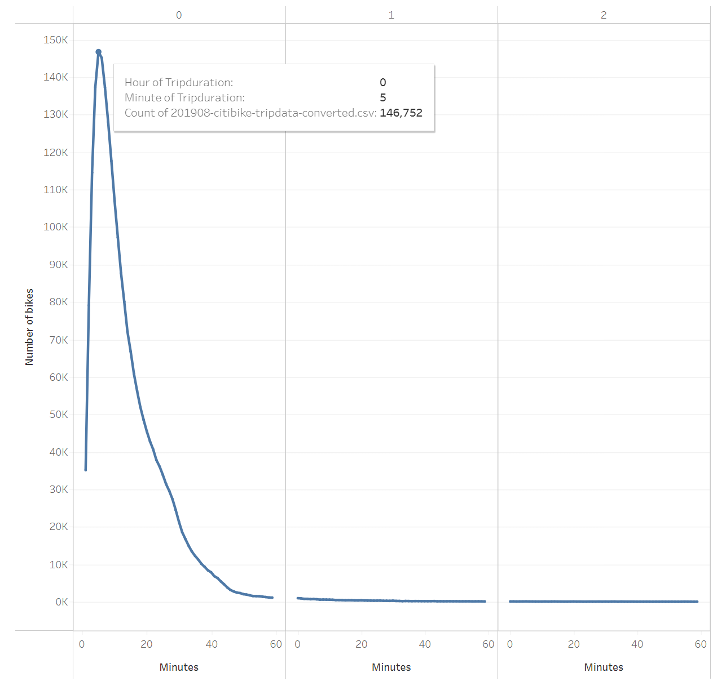
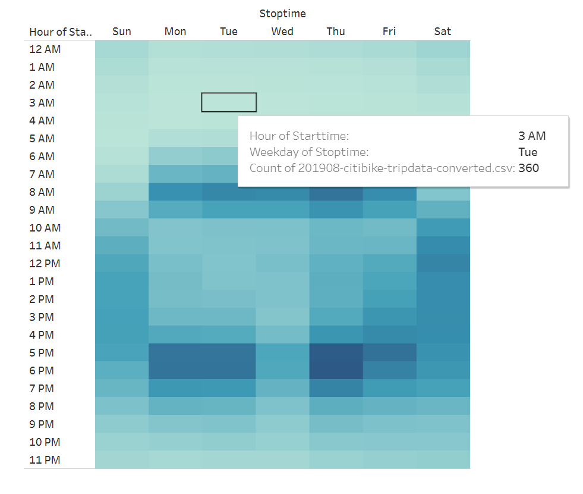
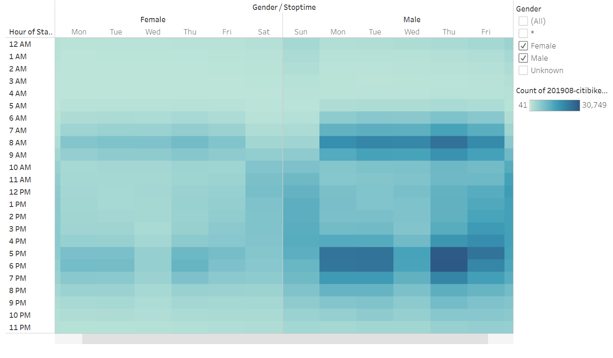
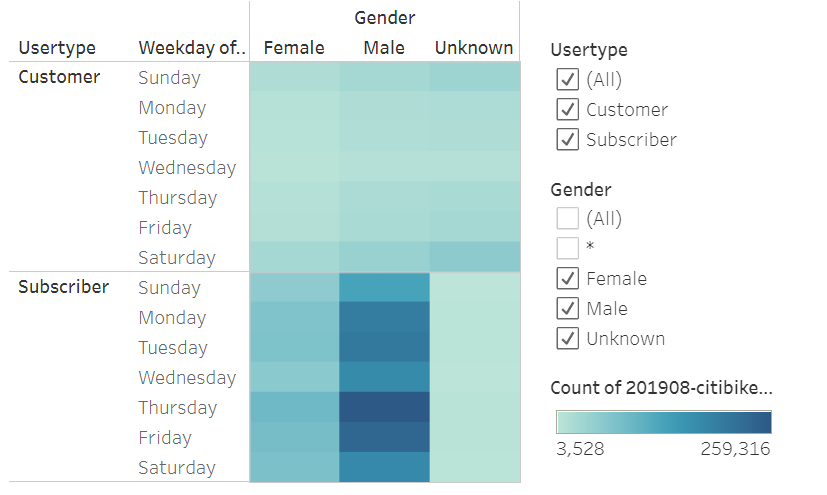
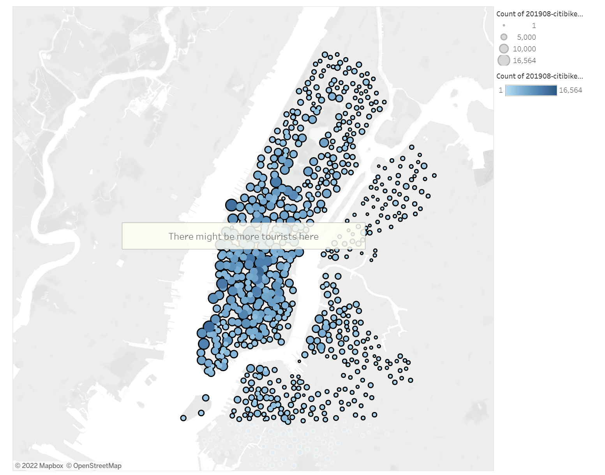
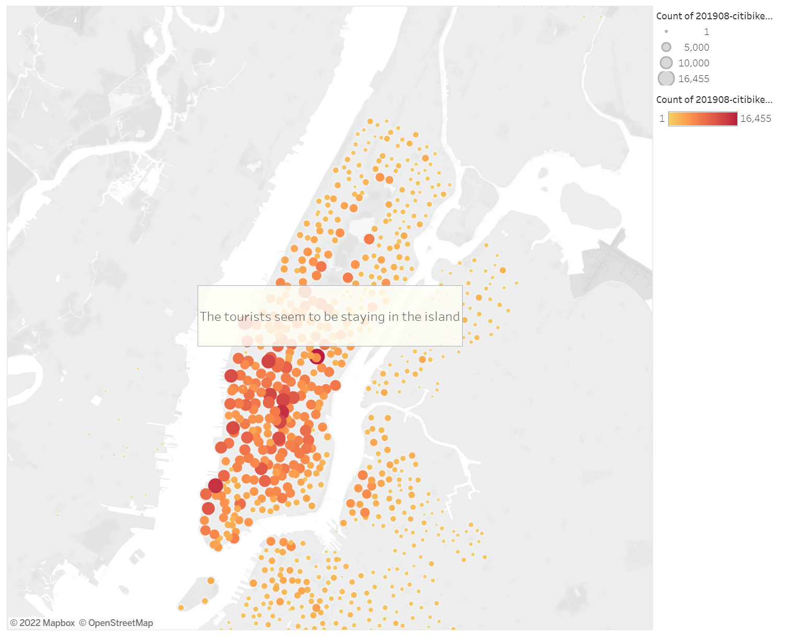

# bikesharing

## Overview
A data analysis of an existing NYC bike share program was performed, to use as a model for a startup project in a different city. The data was obtained in the form of a csv file, containing trip data for the company Citibike, for the month of August in 2019. The data includes tip duration, check-out and check-in times and locations, as well as user gender, types (subscriber or customer, for casual users) and birth year.

## Results
Data visualizations were created using Tableau, and the story can be [viewed here](https://public.tableau.com/app/profile/ana.duchini/viz/NYC_bikesharing_16436004268390/NYCBikeRideStatistics).
### Trip Duration per Bike Ride

Most bike rides are around 5 minutes long.
### Trip Duration by Gender for Short Trips

The above is true for both genders, with females consitituting around 25% of the total users on short rides.
### Trip Duration by Gender for Long Trips

For rides more than 2 hours long, the render distribution is roughly equal.
### Ride Check-out Times per Day of the Week

The highest usage is around peak hours, between 7-9 a.m. and 5-7 p.m. on weekdays, and late in the morning on weekends. The least usage is on Tuesday at 3 a.m.
### Ride Check-out Times by Gender

Utilization by time of day has the same distribution for both genders.
### Ride Check-out Times by Type of User

There is a higher proportion of subscriber users during weekdays (for both genders). The proportion of casual customers appears to be higher on weekends.
### Map of Check-out Locations

Most check-out locations are near tourist landmarks.
### Map of Check-in Locations

The majority of check-in locations appear to remain within locations central to the island of Manhattan.

## Summary
Since usage is at its lowest on Tuesday 3-4 a.m., this might be the most appropriate time for bike maintenance, as well as relocation. For this purpose, it might be worthwhile to create additional visualizations to find out the check-in times for the more remote locations, in order to schedule the relocation of these bikes to places on higher demand.